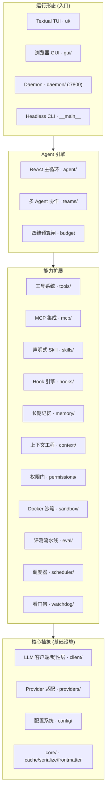

<p align="center">
  
</p>

<!--
【图片 1：assets/hero-cover.png（建议 1536x640，16:9 宽幅横幅）】
生成提示词（复制下面整段到 GPT 图像生成）：
一张科技感的宽幅横幅封面图，主题为「本地优先的 AI 编程智能体运行时」。画面中央偏左是一个简洁的深色代码编辑器主窗口，窗口内有高亮的多行代码片段和一个正在浮现的 AI 星形光标；编辑器背后延伸出柔和的青色与靛蓝色渐变光线，象征智能体在代码、终端容器和记忆网络之间流动。右侧飘浮着三个半透明的玻璃质感卡片，分别标着隐约可见的图标：一个终端图标代表 CLI/TUI、一个服务器机架图标代表本地 daemon、一个沙漏/沙箱立方体图标代表安全沙箱。整体配色以深蓝黑为底，点缀 #3996AE→#046A82 的青蓝渐变强调色，光效柔和、前景清晰，强调「本地运行、纵深安全、容器隔离」的感觉。风格：高端软件产品官网 hero banner，3D 渲染与扁平插画结合，电影感打光，留白充足，无文字或仅极简。
-->

# FlowCoder

<div align="center">

> **本地优先、全自研的 AI 编码 Agent 运行时。** 同一个引擎，三种运行形态：Textual TUI、本地 daemon、headless CLI。

<br>

[]()
[](LICENSE)
[](https://github.com/Ember452/FlowCoder/actions/workflows/ci.yml)
[]()
[]()

</div>

**FlowCoder** 是一个对标 Claude Code 的本地优先 AI 编码助手运行时。它**不依赖任何第三方 Agent 框架**（无 LangGraph / LangChain），从 Agent 核心循环、工具治理、上下文工程、长期记忆到 Docker 沙箱与评测流水线全量自研，技术栈刻意极简。

你的代码永不离开本地：数据以纯文件（JSON / Markdown / JSONL）持久化在本地，无数据库、无消息队列、无云端依赖。可用同一个引擎以三种形态运行——终端 TUI 交互、本地 HTTP/WebSocket daemon、单发 headless CLI，并自带一个浏览器 GUI 桥接。

---

## ✨ 特性亮点

FlowCoder 围绕四条主轴构建，并在其上叠加了生产级的安全、韧性与评测能力：

**🧠 自研 Agent 核心引擎**
- 异步事件驱动的 ReAct 推理-行动主循环，一次请求内可经历"模型 → 工具 → 模型 → 工具 → 收敛"任意多轮
- 统一事件流：`StreamText / ToolUseEvent / ToolResultEvent / PermissionRequest / UsageEvent / CompactNotification / LoopComplete` 等 15+ 事件，TUI、GUI、daemon 统一消费
- 支持并发安全工具批量执行（只读类工具并行）、中断恢复、响应历史与恢复快照

**🧩 工具治理**
- 声明式 Skill（Markdown frontmatter）、MCP 客户端集成、生命周期 Hook 引擎
- Pydantic v2 驱动的 JSON Schema 与参数校验，`ToolSearch` 延迟加载避免撑爆上下文
- 内置工具：读写改文件、Bash、Glob、Grep、子 Agent、AskUserQuestion、Team 协作等

**🧮 上下文工程**
- 滑动窗口 + 自动 compact：对长对话前缀生成结构化摘要，保留尾部原文，写 `compact_boundary` 以便干净恢复
- 大工具结果卸载：超过预算的单条/聚合输出持久化到磁盘，对话内只留预览，可随时回读
- 断路器防压缩风暴，`/rewind` 支持回退

**🔒 权限与执行安全**
- 权限四模式审批门（default / acceptEdits / plan / bypassPermissions / custom / dontAsk）+ 路径沙箱 + 危险命令拦截，且结构性先于工具执行
- Docker 容器级执行隔离（可选）：cgroup 限额、默认断网、只读根 + tmpfs 白名单、双层超时、容器池化与泄漏回收

**🚀 韧性与可靠性**
- `ResilientClient` 韧性层：指数退避重试（429/5xx/网络错误/超时）、进程内令牌桶限流、请求超时兜底
- 四维预算闸（token / 轮次 / 时间 / 成本）：超限"总结并收敛"而非硬杀
- 混沌演练框架：可脚本化注入故障，实测报告见 `docs/reports/chaos-report.md`

**📊 评测流水线**
- HumanEval+ 评测：失败自愈回喂（最多 3 轮修复）、k-sample 首胜、失败四分类、可复现温度
- 混沌/压测数据与逐题 pass 矩阵，量化每一次改动

**注入 多 Agent 与后台服务**
- teams 多智能体协作、子 Agent 委派、mailbox 通信、后台任务调度、A2A 协议桥接、git worktree 隔离
- 可插拔长期记忆 MemoryHub：会话记忆、自动抽取、语义召回
- 可选的 cron 调度器与仓库看门狗（默认关闭，零配置零副作用）

---

## 🖥️ 运行形态

<p align="center">
  
</p>

<!--
【图片 2：assets/tui-screenshot.png（建议 1920x1080，16:9 横屏）】
生成提示词（复制下面整段到 GPT 图像生成）：
一张高质量的终端 3D 演示图，模拟现代 AI 编程的 TUI（Textual）终端界面半仰视角。画面是深色终端的清晰等宽字体界面：左侧窄边栏有会话列表与 teammate 树，中部是聊天式对话流——用户消息块、AI 回复块、一次工具调用在当前行高亮显示（一个小工具图标 + 参数），下方是正在流式输出的闪烁光标；右下方有一个权限审批小弹窗（允许/拒绝/总是允许 三个按钮）。窗口有质感玻璃渐变边框和柔和的青色高光。背景是一个真实的程序员工作桌面氛围（隐约的代码文件、一杯咖啡、柔和光线），整个画面以深蓝黑与青蓝渐变为主，强调「本地、实时流式、安全审批」的体验。风格：产品宣传图 / 软件官网 mockup，清晰、精致、无实际可读文字或少量占位文本。
-->

| 形态 | 入口 | 适用场景 |
|---|---|---|
| **TUI 交互** | `flowcoder` | 日常终端里的人工对话、权限审批、计划模式 |
| **Headless CLI** | `flowcoder -p "prompt"` | 脚本化单发任务、CI、管道 |
| **本地 daemon** | `flowcoder-daemon`（默认端口 `:7800`） | 会话管理、任务编排、WebSocket 实时推流、A2A 桥接 |
| **浏览器 GUI** | 内置桥接（`src/flowcoder/gui/index.html`） | 可视化会话与权限交互 |

三种形态共用 **同一个 `Agent` 引擎与事件流**，差异仅在最外层入口。

---

## 🏗️ 架构概览

四层分层，依赖方向硬性约束：**上层可依赖下层，下层禁止 import 上层**；跨模块通信优先走 Agent 的事件流。



一次请求的主干：

```text
用户输入（TUI / daemon / CLI）
  → ConversationManager（对话状态层）
  → Agent.run()：预算判定 → 压缩检查 → 权限授权 → LLM 调用
     → ResilientClient（限流 → 重试 → 超时兜底 → 协议客户端）
  → StreamCollector → 事件流（文本/思考/工具/用量/…）
  → 工具执行（权限门 → 沙箱/子进程双通道）→ 结果回填 → 下一轮
  → 无工具调用 → LoopComplete
```

完整的端到端数据流、多轮语义与模块设计见 [docs/architecture/](docs/architecture/INDEX.md)。

---

## 🚀 快速开始

### 环境要求

- **Python 3.11+**
- [uv](https://docs.astral.sh/uv/)（推荐）

### 安装

```bash
# 基础安装（含测试依赖）
uv pip install -e ".[dev]"

# 如需 Docker 沙箱隔离（可选）
uv pip install -e ".[sandbox]"
```

### 最小配置

首次运行会在需要时引导你配置 `~/.flowcoder/config.yaml`，也可手动创建（provider 的 `api_key` 支持 `${ENV_VAR}` 展开，空则回退 `ANTHROPIC_API_KEY` / `OPENAI_API_KEY`）：

```yaml
# ~/.flowcoder/config.yaml
providers:
  - name: anthropic
    protocol: anthropic          # anthropic | openai | openai-compat
    model: claude-sonnet-4-5
    api_key: ${ANTHROPIC_API_KEY}
  - name: openai
    protocol: openai
    model: gpt-5
    api_key: ${OPENAI_API_KEY}

permission_mode: default         # default | acceptEdits | plan | bypassPermissions | custom | dontAsk
sandbox_mode: off                # off | docker（容器级隔离）
```

### 第一个会话

```bash
# TUI 交互模式：人工对话、工具调用、权限审批
flowcoder

# headless 模式：单发执行 prompt 并打印结果（适合脚本/CI）
flowcoder -p "review the test/ directory and summarize the coverage gaps"

# 启动本地 daemon（HTTP/WebSocket，默认端口 7800）
flowcoder-daemon

# 评测流水线（HumanEval+）
python -m flowcoder.eval
```

---

## ⚙️ 配置系统

配置为 **三层按优先级合并**（后覆盖前）：

1. `~/.flowcoder/config.yaml` —— 用户级
2. `<cwd>/.flowcoder/config.yaml` —— 项目级
3. `<cwd>/.flowcoder/config.local.yaml` —— 本地覆盖（不入 git）

关键可配能力包括：model provider（协议/思考模式/温度）、`sandbox_mode`、`mcp_servers`、`hooks`、`memory` provider、worktree 隔离，以及可选的 `scheduler`、`watchdog`、`budget` 后台能力。完整键位与校验语义见 [docs/architecture/config.md](docs/architecture/config.md)。

---

## 🔒 安全模型

<p align="center">
  
</p>

<!--
【图片 3：assets/sandbox-isolation.png（建议 1536x896，约 4:3 横屏）】
生成提示词（复制下面整段到 GPT 图像生成）：
一张「纵深防御 + 容器隔离」示意图，3D 概念渲染。画面中央一个半透明发光的立方体容器（Docker 沙箱），立方体表面浮动着锁形与盾形图标；立方体内部有一行代码和一株幼苗形状的执行进程，象征受限但安全的运行环境。立方体被多层半透明围墙环绕：最外层是「权限审批门」标签（Permission Gate），中层是「路径沙箱」标签（Path Sandbox），内层紧贴容器是「断网/只读根/cgroup 限额」标签（No Network · Read-only Root · cgroups）。背景为深蓝黑渐变，光线从容器透出，整体传达「纵深防御、默认断网、分层安全」的视觉隐喻。风格：企业级安全产品示意图，极简高端，青蓝 #3996AE→#046A82 渐变主色，无文字或仅有极小标签。
-->

FlowCoder 的防护是结构性的多层纵深，顺序不可颠倒：

1. **权限审批门**：每个工具调用先过四模式审批 + 危险命令检测 + 路径沙箱（resolve 后白名单校验），`ask` 结果产生 `PermissionRequest` 由你来决定。
2. **执行通道**：`Bash` 工具有 `subprocess`（默认）与 `sandbox_mode: docker` 两条通道。打开沙箱后进入容器池，容器**默认断网**（`network_mode=none`）、根文件系统只读、仅 `/workspace` 与 `/tmp` 两个 tmpfs 可写、cgroup 三维限额、双层超时兜底。
3. **只读优先**：恶意或失控的命令在沙箱内也无法篡改镜像或写宿主。
4. **/sandbox 切换**：`/sandbox off|docker` 斜杠命令即时切换并持久化；未装 Docker 时显式报错，绝不静默降级。

权限门**先于**沙箱执行是结构性保证（授权层先于 `tool.execute`），独立测试守住该断言。详见 [docs/architecture/sandbox.md](docs/architecture/sandbox.md) 与 [permissions-hooks.md](docs/architecture/permissions-hooks.md)。

---

## 🧮 上下文工程

<p align="center">
  
</p>

<!--
【图片 4：assets/context-engineering.png（建议 1536x896，约 4:3 横屏）】
生成提示词（复制下面整段到 GPT 图像生成）：
一张「长对话上下文管理」的抽象概念图。画面是一条长长的水平对话时间轴从左向右延伸，随着对话增长，左侧对话气泡逐渐变小、变朦胧并收缩成一叠整齐的「摘要卡片」（代表 auto-compact 压缩），右侧保留少量清晰的最新对话气泡；时间轴下方有几个大型工具输出被放进一个打开的收纳箱/档案柜，旁边标了小图标表示「已持久化到磁盘、对话内仅留预览」。载体选用等宽字体代码块的抽象化表现，深色背景，青色与靛蓝渐变光线连接各元素。风格：理解长对话/窗口/压缩/卸载的软件架构概念插画，干净、留白、高端科技感，无文字或极简标签。
-->

长对话不爆上下文，靠两层保护：

- **工具结果预算**：单条 > 50K 字符、聚合 > 200K 字符的结果自动持久化到磁盘并替换为预览；完成过的替换决策稳定重放，不重复消耗。
- **自动 compact**：接近上下文窗口阈值时，对较早前缀生成结构化摘要，保留尾部最近消息原文，写入 `compact_boundary`；恢复时只重放"摘要 + 尾部"，不会把压缩前的完整历史塞回窗口。

详见 [docs/architecture/context-memory.md](docs/architecture/context-memory.md)。

---

## 📚 文档

项目文档充足，按入口组织：

- **[docs/architecture/](docs/architecture/INDEX.md)** —— 23 篇架构文档：Agent 循环、数据流、LLM 客户端、上下文记忆、权限钩子、沙箱、评测、调度器、看门狗、可观测性等
- **[docs/development/](docs/development/README.md)** —— 21 讲开发教程与快速上手、环境搭建、贡献指南
- **[docs/plans/](docs/plans/)** —— 改造计划、评审快照、差异化路线与框架重构计划
- **[docs/specs/](docs/specs/)** —— ADR 决策记录与规格
- **[CHANGELOG.md](CHANGELOG.md)** —— 版本历史（Keep a Changelog）

---

## 🗂️ 项目结构

`src` layout + 分层架构：

```
src/flowcoder/
├── agent/          # Agent 核心循环、事件流、恢复快照、预算闸（引擎心脏）
├── agents/         # Agent 变体定义与任务管理
├── teams/          # 多智能体协作（编排、mailbox、委派）
├── context/        # 上下文工程：压缩、卸载、恢复
├── memory/         # 长期记忆 MemoryHub 与语义召回
├── tools/          # 内置工具
├── skills/         # 声明式技能加载
├── mcp/            # MCP 客户端与工具接入
├── hooks/          # 生命周期钩子引擎
├── permissions/    # 权限门、路径沙箱、四模式审批
├── sandbox/        # Docker 沙箱：容器池、限额、断网、回收
├── eval/           # HumanEval+ 评测流水线
├── scheduler/      # cron 调度器（定时驱动 Agent 回合）
├── watchdog/       # 仓库看门狗（信号源 + 防骚扰门控）
├── providers/      # LLM 多协议适配与流式解析
├── client/         # LLM 客户端、韧性层
├── config/         # 配置加载与校验
├── commands/       # 斜杠命令解析
├── daemon/         # Starlette 服务端、任务注册、WebSocket
├── a2a/            # A2A 协议桥接
├── account/        # 云端账号引导
├── worktree/       # git worktree 隔离
├── filehistory/    # 文件历史快照
├── gui/            # 浏览器 GUI 桥接
└── ui/             # TUI 交互组件

tests/
├── unit/           # 单元测试（fake 隔离，不碰网络/文件系统）
├── integration/    # 模块间集成测试
└── e2e/            # 端到端测试（TUI / daemon / 沙箱关键路径）
```

不同模块的职责边界与依赖规则在 [AGENTS.md](AGENTS.md) 中有严格约束。

---

## 🛠️ 开发指南

```bash
# 代码检查与格式化（提交前必须通过）
ruff check .
ruff format .

# 测试（三层递进）
pytest tests/unit -q            # 单元测试
pytest tests/integration -q     # 集成测试（docker 相关会自动跳过）
pytest tests/e2e -q             # 端到端关键路径

# 混沌演练（可选，需本地 Docker）
python scripts/chaos.py
```

- **类型**：公共 API 用 pydantic v2 模型 + 类型注解，pyright 严格模式零新增错误约束
- **架构纪律**：下层模块禁止 import 上层；展示层不得直接操作 LLM 客户端或权限门；跨模块通信优先走事件流
- **提交规范**：Conventional Commits，一个逻辑变更一组 commit，描述写"为什么变"

开发前请先读 [AGENTS.md](AGENTS.md) 与相关架构文档，避免改动核心循环而不自知。

---

## 🗺️ 路线图

- **已落地**：Docker 沙箱与容器池（P1）、HumanEval+ 评测与自愈（P2）、LLM 韧性层与预算闸（P3/P4）、cron 调度器与仓库看门狗接线（P5.5）
- **规划中**：跨模块 Outbox 事件分发、`keel/` 框架抽象（把 Agent 循环、权限门、上下文管理、事件流协议下沉为通用 Agent 框架层，以"换领域只写新工具集"验证抽象）——详见 [docs/plans/FRAMEWORK_REFACTOR_PLAN.md](docs/plans/FRAMEWORK_REFACTOR_PLAN.md)

---

## 🤝 贡献

欢迎提交 issue、PR 或架构评审。改动前请阅读 [contributing.md](docs/development/contributing.md) 与 [AGENTS.md](AGENTS.md)。CI 会在每次提交上运行 lint 与完整测试。

## License

[MIT](LICENSE) © FlowCoder 作者